# 🕰️ Doomsday AI: The Autonomous Risk Clock

[](https://doomsday-ai-lzee.vercel.app/)
[](https://github.com/iamnih4l/doomsday-ai/actions)
[](https://deepmind.google/technologies/gemini/)
[](https://opensource.org/licenses/MIT)

> **"What time is it?"**
> Currently: **90 Seconds to Midnight.** ⚠️

[**🔴 VIEW LIVE CLOCK**](https://doomsday-ai-lzee.vercel.app/)

---

## 🌍 What is this?
**Doomsday AI** is a fully autonomous, self-operating backend that monitors the state of the world 24/7.
It uses **Artificial Intelligence (Google Gemini)** to read global news, analyze risks (Nuclear, Climate, AI, Bio), and decide if humanity is closer to or further from catastrophe.

### 🧠 How It Works (The "Brain")

```mermaid
graph TD
    A[🌍 BBC/Reuters RSS Feeds] -->|Every 10 mins| B(📰 News Ingestion Service)
    B -->|Raw Articles| C{🤖 Gemini AI Decision Engine}
    C -->|Analyze Risk & Sentiment| D[📊 Risk Database]
    C -->|Extract Location| E[🗺️ Global Heatmap]
    C -->|Update Time| F[🕰️ The Doomsday Clock]
    F -->|Real-time Update| G[💻 Live Dashboard]
```


---

## ✨ Key Features
| Feature | Status | Description |
| :--- | :---: | :--- |
| ** autonomous_clock** | ✅ | Adjusts time based on real events (Wars, Treaties, etc.). |
| ** news_scraper** | ✅ | Ingests headlines from major global sources every 10 mins. |
| ** ai_explanation** | ✅ | Generates readable summaries "Why the clock moved". |
| ** dynamic_map** | ✅ | Updates a live heatmap of global conflict zones. |
| ** rate_limited** | ✅ | Protected against API abuse and spam. |

---

## 🚀 Easy Deployment (1-Click)

Want your own Doomsday Clock?

[](https://vercel.com/new/clone?repository-url=https%3A%2F%2Fgithub.com%2Fiamnih4l%2Fdoomsday-ai&env=MONGODB_URI,GEMINI_API_KEY,ADMIN_API_KEY)

**Required Environment Variables:**
1.  `MONGODB_URI`: Connection string for MongoDB Atlas.
2.  `GEMINI_API_KEY`: Get it from [Google AI Studio](https://aistudio.google.com/).
3.  `ADMIN_API_KEY`: A secure password you create to protect admin routes.

---

## 🛠️ Manual Setup (For Developers)

<details>
<summary>Click to expand Local Installation Guide</summary>

### 1. Clone & Install
```bash
git clone https://github.com/iamnih4l/doomsday-ai.git
cd doomsday-ai
npm install
```

### 2. Configure Environment
Create a `.env.local` file:
```properties
MONGODB_URI=mongodb+srv://...
GEMINI_API_KEY=AIzaSy...
ADMIN_API_KEY=secret123
```

### 3. Run Locally
```bash
npm run dev
```

### 4. Manually Trigger AI
Since corn jobs don't run automatically on localhost:
```bash
npm run cron:news    # Fetches news
```

</details>

---

## 📚 API Documentation

Doomsday AI provides a public REST API for developers to build their own frontends.

**Base URL**: `https://doomsday-ai-lzee.vercel.app/api`

### `GET /clock/current`
Returns the current time and risk level.
```json
{
  "secondsToMidnight": 90,
  "riskLevel": "Critical",
  "primaryFactors": ["Nuclear Escalation", "AI Safety"]
}
```

### `GET /risk/breakdown`
Returns the score (0-100) for each risk category.
```json
{
  "Nuclear": 85,
  "Climate": 70,
  "AI": 60
}
```

---

## 🤝 Contributing
1.  Fork the Project
2.  Create your Feature Branch (`git checkout -b feature/AmazingFeature`)
3.  Commit your Changes (`git commit -m 'Add some AmazingFeature'`)
4.  Push to the Branch (`git push origin feature/AmazingFeature`)
5.  Open a Pull Request

---

*This project is for educational purposes and is not affiliated with the Bulletin of the Atomic Scientists.*
